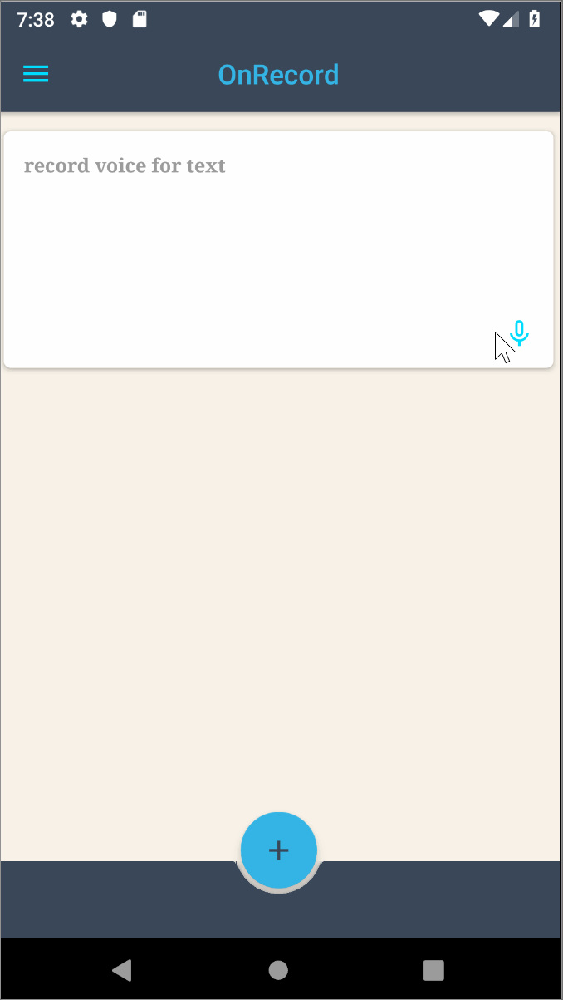
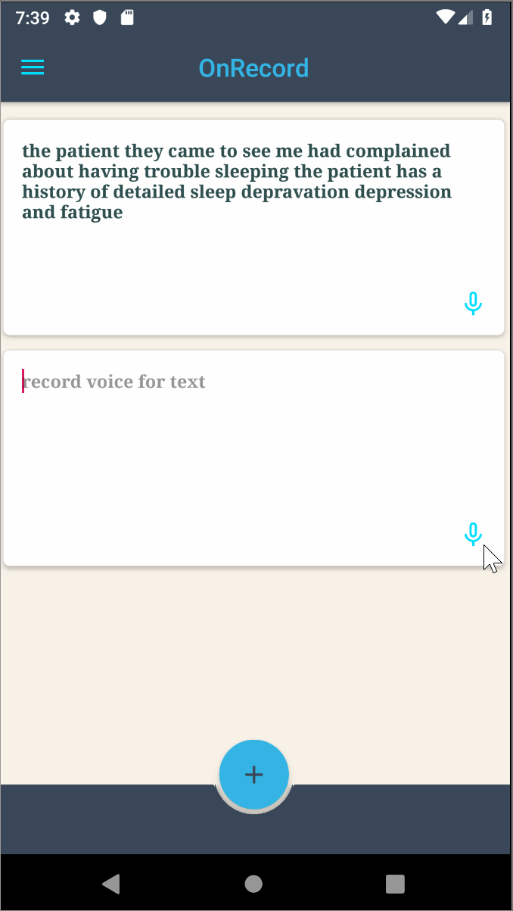

# OnRecord_Application
Application Prototype of OnRecord, which is an application that uses IBM Watson's Speech-to-Text resource to transcribe words into 
text from a user's speech in real time, this application intended to target doctors, allowing to them better obtain patient data through
the use of speech thereby facilitating the patient data-entry process for doctors and allowing them to input and save that data into a system.

The goal of this application is to save doctors both the time and frustration to input patient data into a system by better obtaining that data
through the use of speech, and allowing doctors to see more of their patients.

## Displaying OnRecord

